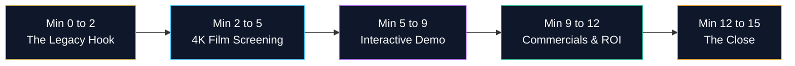

# HRL International × Rohan Corporation — Executive Client Pitch & Video Walkthrough Guide

**Document Purpose**: High-Stakes Client Presentation Strategy & Meeting Playbook  
**Target Executive**: Rohan Monteiro (Founder & Managing Director, Rohan Corporation)  
**Presented by**: Pavan Kumar Sadashiv (Founder & Managing Director, HRL International Private Limited)  
**Objective**: Secure immediate enterprise approval and signature of the PropTech Joint Partnership  

---

## 1. The 15-Minute Winning Pitch Architecture

### Minute 0 – 2: The Legacy Hook (Opening Statement)
> *"Mr. Monteiro, for thirty years Rohan Corporation has set the benchmark for building quality in Mangaluru. But today, the ultra-luxury buyer and the Gulf NRI investor no longer buy just concrete and steel—they buy an intelligent, frictionless digital living experience. We have built a platform exclusively for Rohan Corporation that gives your buyers the same digital sophistication they experience with Apple products."*

---

### Minute 2 – 5: The 4K Master Film Screening
Launch the presentation video in full-screen on your MacBook Pro / iPad or AirPlay to the conference room display:
- **URL**: `https://hrlpavan.github.io/hrl-x-rohan-corporation/video.html`
- **Audio**: Unmute and let the procedural binaural score and executive voiceover command the room.

#### Timestamp Talking Points during Screening:
* **0:00 – 0:25 (The Genesis)**: Emphasize how your brand names merge as equals in prestige.
* **0:25 – 0:55 (The Portfolio)**: Point out Rohan City, Rohan Crown, Rohan Square, and Rohan Estate—showing him that this is **custom-tailored to his actual properties**, not a generic template.
* **0:55 – 1:25 (3D Digital Twin Engine)**: Highlight the real-time solar daylight calculations and coastal sea breeze vector. Explain that an NRI in Dubai can see exact balcony sun at 5:00 PM without flying to Mangaluru.
* **1:25 – 1:55 (Edge IoT & Zero-Cloud Privacy)**: Crucial credibility point: Explain that resident biometric credentials never touch external cloud servers, preventing liability under the *Digital Personal Data Protection Act 2023*.
* **1:55 – 2:15 (Financial & NRI Model)**: Demonstrate the instant EMI amortization and 5% rental yield simulator that turns curious prospects into committed buyers.
* **2:15 – 2:30 (The Finale)**: Conclude with the joint executive signatories.

---

### Minute 5 – 9: Hands-On Interactive Portal Walkthrough
Switch from the film to the live portal (`https://hrlpavan.github.io/hrl-x-rohan-corporation/`):
1. **Bento Grid Exploration**: Show how each property card opens an instant 3D Digital Twin view.
2. **Interactive Solar Simulator**: Toggle between **Daylight**, **Golden Hour**, and **Night** on the WebGL canvas.
3. **Apple Card-Style Calculator**: Drag the Property Value slider to ₹1.2 Crores and watch the numbers recalculate smoothly in real time.

---

### Minute 9 – 12: Capital Outlay & Commercial Terms
Review the pre-calculated platform budget from **[`docs/PROJECT_TOTAL_EXPENSE.md`](PROJECT_TOTAL_EXPENSE.md)**:
- Total Dedicated Platform Capital Outlay: **₹18,00,000** across 4 milestone tranches.
- **ROI Justification**: The entire platform budget is recovered upon the sale of **just one luxury residential unit** at Rohan Crown or Rohan City. Everything after that is pure margin enhancement and brand elevation.

---

### Minute 12 – 15: The Close (Action Step)
Place the **[`docs/PARTNERSHIP_CHARTER.md`](PARTNERSHIP_CHARTER.md)** and the **[`docs/PROJECT_STARTUP_BLUEPRINT.md`](PROJECT_STARTUP_BLUEPRINT.md)** on the table:
> *"Mr. Monteiro, the entire software architecture, 4K film, and interactive engine are already built and live on GitHub. If we initiate Phase 1 today, our RTK drone will conduct the baseline calibration flight at Rohan City by next week. Let's sign the partnership charter and lead the future of real estate in India together."*

---

*Prepared by HRL International Private Limited for Rohan Corporation Executive Review.*
