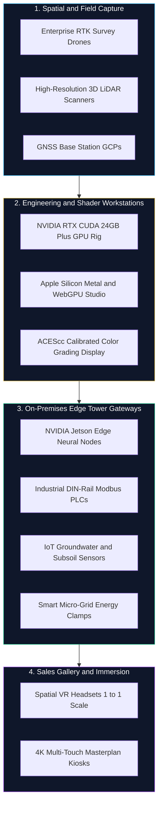

# HRL International × Rohan Corporation — Technical Equipment & Hardware Specification

**Initiative**: Smart PropTech & Next-Generation Digital Real Estate Ecosystem  
**Collaborating Principals**:
- **HRL International Private Limited** (Founder & Managing Director: Pavan Kumar Sadashiv)
- **Rohan Corporation** (Mangaluru, Karnataka)  
**Document Version**: 2026 Hardware Master Schedule  
**Target Deployments**: Rohan City (Bejai), Rohan Crown (Kadri), Rohan Square (Pumpwell), Rohan Estate (Neermarga)  

---

## 1. Executive Summary

Executing the **HRL × Rohan Corporation** PropTech platform requires specialized field photogrammetry, high-throughput GPU computing workstations, on-premises edge IoT controllers, and interactive customer immersion displays.

The architecture emphasizes **Zero-Cloud Privacy**—ensuring all sensor telemetry and biometric credentials remain securely processed on local tower hardware without leaking sensitive homeowner data to third-party public clouds.



---

## 2. Detailed Equipment Inventory & Technical Specs

### Category 1: Aerial Topography & 3D Spatial Capture (Field Gear)

| Equipment | Model / Specification | Function & Deployment Target |
| :--- | :--- | :--- |
| **Enterprise Survey Drone** | **DJI Mavic 3 Enterprise (RTK) / Matrice 350** | High-altitude exterior facade capture, terrain slope calculation, and millimeter-accurate mesh creation for **Rohan City** & **Rohan Estate (Neermarga)**. |
| **Interior 3D LiDAR Scanner** | **Matterport Pro3 / Leica BLK360** | Millimeter-accurate interior point-cloud capture and virtual walk-through generation for **Rohan Crown** luxury sky mansions. |
| **RTK GNSS Base Station & Tripod** | **D-RTK 2 High-Precision GNSS Station** | Sub-centimeter Ground Control Point (GCP) geo-referencing to ensure statutory alignment with sanctioned Karnataka RERA plot blueprints. |

---

### Category 2: Visual Computing & Development Workstations

| Equipment | Specification | Function |
| :--- | :--- | :--- |
| **AI & Graphics Engineering Rig** | **NVIDIA RTX 4090 / RTX 6000 Ada (24GB+ VRAM)**, AMD Ryzen 9 / Threadripper, 64GB DDR5 | CUDA acceleration for baking Neural Radiance Fields (NeRF), 3D Gaussian Splatting, and WebGL assets. |
| **Apple Silicon Dev Workstation** | **MacBook Pro M3/M4 Max / Mac Studio (64GB Unified Memory)** | Metal Shading Language (MSL) profiling, WebGPU optimization, and iOS Safari touch responsiveness validation. |
| **Color-Calibrated HDR Display** | **32-inch 4K DCI-P3 99% Professional Monitor (ASUS ProArt / BenQ)** | ACEScc color science calibration for realistic coastal natural lighting, balcony glare, and Arabian Sea views. |

---

### Category 3: On-Device Edge IoT & Building Gateways (Tower Hardware)

| Equipment | Specification | Function & Target Landmark |
| :--- | :--- | :--- |
| **Edge AI Neural Accelerators** | **NVIDIA Jetson Orin Nano / Orin NX (8GB/16GB)** | Edge computer vision for parking occupancy, pedestrian flow, and HVAC demand at **Rohan City** & **Rohan Square**. |
| **Industrial IoT Edge Micro-PLCs** | **DIN-Rail Industrial Raspberry Pi 5 / ESP32-S3 PLCs** | RS485 / Modbus / BACnet protocol bridges interfacing with generator panels, water pumps, and elevator telemetry. |
| **Smart Environmental & Soil Sensors** | **Modbus Subsoil Moisture, PM2.5, Ultrasonic Water Meters** | Real-time groundwater monitoring at **Rohan Estate** and ambient indoor air quality tracking at **Rohan Crown**. |
| **Smart CT Energy Metering Clamps** | **Schneider / Siemens 3-Phase Smart Modbus Meters** | Power grid telemetry for commercial tenants and common amenities energy monitoring. |

---

### Category 4: Tower Server & Network Infrastructure

| Equipment | Specification | Function |
| :--- | :--- | :--- |
| **Managed Industrial PoE+ Switches** | **16/24-Port Gigabit DIN-Rail PoE+ (Cisco / Ubiquiti)** | Distributes power and high-speed networking to edge cameras, biometric access doors, and IoT sensors without separate conduits. |
| **Local Encrypted Edge NAS / Server** | **1U Rackmount Server / Synology 4-Bay RAID-10 (NVMe)** | Secure on-premise encrypted storage for telemetry, DPDP 2023 audit trails, and resident data privacy. |
| **Online Double-Conversion UPS** | **2kVA / 3kVA Pure Sine Wave UPS (APC / Emerson)** | Safeguarding sensitive edge processors and network nodes from coastal power surges and monsoon grid fluctuations. |

---

### Category 5: Sales Gallery & VIP Experience Center (Buyer Immersion)

| Equipment | Specification | Function |
| :--- | :--- | :--- |
| **Spatial VR Headset** | **Apple Vision Pro / Meta Quest 3** | Allows prospective buyers and global NRI investors to walk through unbuilt penthouses at true 1:1 scale in the sales gallery. |
| **Interactive 4K Smart Touch Table** | **55-inch to 65-inch Ultra-HD Multi-Touch Interactive Kiosk** | Collaborative master plan navigation, unit selection, and real-time EMI & ROI simulation during customer consultations. |

---

## 3. Capital Expenditure & Procurement Schedule

```
┌────────────────────────────────────────────────────────┬────────────────┐
│ Equipment Category                                     │ Estimated Cost │
├────────────────────────────────────────────────────────┼────────────────┤
│ 1. Drone & LiDAR Photogrammetry Hardware               │  ₹ 3,50,000    │
│ 2. Visual Computing & Shading Workstation Setup        │  ₹ 4,00,000    │
│ 3. On-Premise Edge IoT Gateways & Industrial Sensors   │  ₹ 5,00,000    │
│ 4. Tower Networking, NAS & Power Protection            │  ₹ 2,50,000    │
│ 5. Experience Center Touch Kiosks & VR Headsets        │  ₹ 3,00,000    │
├────────────────────────────────────────────────────────┼────────────────┤
│ TOTAL EQUIPMENT CAPITAL EXPENDITURE                    │  ₹ 18,00,000   │
└────────────────────────────────────────────────────────┴────────────────┘
```

---

## 4. Maintenance, Calibration & Warranty Governance

1. **Annual Maintenance Contracts (AMC)**: Mission-critical hardware (drones, edge Jetson nodes, and network switches) are maintained under 3-year OEM enterprise warranties.
2. **Periodic Sensor Calibration**: IoT groundwater and air quality probes are calibrated semi-annually to preserve measurement integrity.
3. **Firmware Security Lockdown**: All edge controllers receive signed over-the-air (OTA) updates isolated within private local VLANs.

---

*Formulated by HRL International Private Limited for Rohan Corporation.*  
*Official Contact*: `hrlinternationalprivatelimited@gmail.com`
