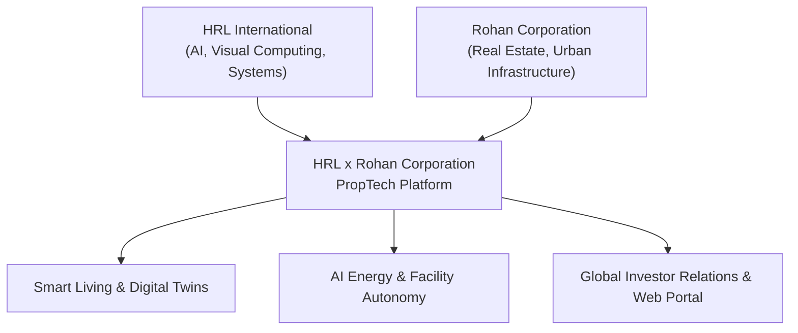

# Strategic Partnership Charter: HRL International × Rohan Corporation

**Initiative**: Smart PropTech & Next-Generation Digital Real Estate Ecosystem  
**Collaborating Principals**:
- **HRL International Private Limited** (Founder & Managing Director: Pavan Kumar Sadashiv)
- **Rohan Corporation** (Mangaluru's Premier Real Estate & Infrastructure Developer)  
**Jurisdiction & Hub**: Mangaluru, Coastal Karnataka, India  
**Date of Formulation**: September 2026  

---

## 1. Vision & Executive Rationale

The collaboration between **HRL International Private Limited** and **Rohan Corporation** bridges the physical frontier of ultra-luxury civil engineering with the apex of software architecture, visual computing, and edge artificial intelligence.

Rohan Corporation has shaped the skyline of Mangaluru with landmark properties such as **Rohan City (Bejai)**, **Rohan Crown**, **Rohan Square**, **Rohan Avenue**, and expansive plotted developments like **Rohan Estate (Neermarga)**. 

Through this collaborative technology framework, HRL International injects proprietary computing intelligence, architectural digital twins, real-time energy automation, and an omnichannel investor portal directly into Rohan Corporation's past, current, and upcoming developments.

---

## 2. Core Pillars of Collaboration

### Pillar I: Photorealistic Architectural Digital Twins
- WebGL / WebGPU interactive 3D floor plan explorer for all prospective buyers and NRI investors.
- Virtual reality walk-throughs powered by HRL’s visual computing shaders, allowing prospective residents worldwide to experience natural sunlight angles, sea breeze simulation, and custom interior finishes.

### Pillar II: On-Premises & Edge Smart Home Intelligence
- Integrating localized, privacy-centric AI controllers within residences at Rohan City and Rohan Crown.
- Localized telemetry for HVAC, energy consumption, water metering, and security access without reliance on third-party cloud data brokers.

### Pillar III: Automated Investor Relations & Valuation Engine
- Real-time valuation telemetry, rental yield forecasting, and transparent statutory RERA verification dashboard.
- Frictionless investor onboarding for both domestic homebuyers and the Mangalorean diaspora across the Gulf and Western markets.

---

## 3. Flagship Portfolio Integration

| Property Name | Classification | Location | PropTech Integration Tier |
| :--- | :--- | :--- | :--- |
| **Rohan City** | Integrated Township & Commercial Hub | Bejai Main Road, Mangaluru | Tier-1: Full Digital Twin, Commercial Footfall AI, Smart Parking |
| **Rohan Crown** | Ultra-Luxury High-Rise Residential | Kadri / Bejai, Mangaluru | Tier-1: Smart Penthouse Automation, Biometric Concierge |
| **Rohan Square** | Mixed Commercial & Executive Suites | Capitanio / Pumpwell, Mangaluru | Tier-2: Intelligent Energy Grids & Workspace Access Management |
| **Rohan Estate** | Gated Plotted Community | Neermarga Hills, Mangaluru | Tier-2: Topographic Drone Mapping, IoT Water Conservation System |
| **Rohan Avenue** | Boutique Residential Residences | Mangaluru Core | Tier-3: App-driven Security & Resident Amenities Portal |

---

## 4. Governance & Intellectual Property Rights

1. **Software & Algorithmic IP**: All algorithms, software pipelines, WebGPU engines, and edge neural networks developed by HRL International remain the exclusive statutory intellectual property of **HRL International Private Limited** under the Indian Copyright Act 1957 and Patents Act 1970.
2. **Real Estate Brand Marks**: The names, logos, architectural blueprints, and trademarks of Rohan Corporation remain the exclusive property of **Rohan Corporation**.
3. **Data Sovereignty**: Resident and visitor telemetry collected through on-premise hardware is strictly anonymized, ensuring total compliance with the *Digital Personal Data Protection Act (DPDP) 2023*.

---

*Formulated by HRL International Private Limited in Mangaluru, Karnataka.*
