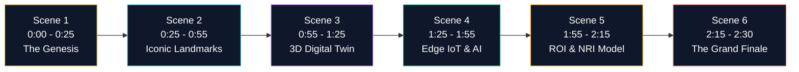

# HRL International × Rohan Corporation — Master Explainer Video Script & Storyboard

**Video Title**: *Bridging Civil Grandeur with Computational Intelligence*  
**Duration**: ~2 Minutes 30 Seconds  
**Resolution**: 4K UHD (3840 × 2160) / 1080p (1920 × 1080) at 60 FPS  
**Target Audience**: Prospective Luxury Homebuyers, Commercial Tenants, Global NRI Investors & Strategic Partners  
**Audio Score**: Cinematic Obsidian & Gold Ambient Electronic Chords, Sub-bass swell, Crisp Spatial Audio  
**Narrator Tone**: Authoritative, visionary, refined, executive British/International English  

---

## Storyboard & Scene Breakdown

---

### Scene 1: The Genesis & The Vision (0:00 – 0:25)
* **Visuals**: Deep obsidian cosmos fading into a sunrise over the Arabian Sea and Mangaluru skyline. Gold particle lines converge to form the dual emblems: `HRL™` and `ROHAN CORPORATION`.
* **On-Screen Text**:
  - HRL INTERNATIONAL × ROHAN CORPORATION
  - Mangaluru Smart PropTech Initiative • 2026
* **Voiceover (VO)**:
  > *"For over thirty years, Rohan Corporation has sculpted the skyline of Mangaluru, engineering architectural landmarks celebrated for enduring luxury and trust. Today, that legacy of physical grandeur converges with the apex of computational intelligence. Welcome to the HRL International and Rohan Corporation PropTech Platform."*
* **Sound Design**: Deep orchestral synth swell with crisp glass chime.

---

### Scene 2: The Landmark Portfolio (0:25 – 0:55)
* **Visuals**: Dynamic 3D architectural elevations rotate into view with glowing neon spec labels:
  1. **Rohan City (Bejai)**: Massive commercial arcade & twin towers.
  2. **Rohan Crown (Kadri)**: Ultra-luxury sky mansion overlooking coastal waters.
  3. **Rohan Square (Pumpwell)**: Grade-A corporate transit hub.
  4. **Rohan Estate (Neermarga)**: Scenic hillside plotted sanctuary.
* **On-Screen Text**:
  - Rohan City: Commercial & Skydeck Residences • Bejai Main Road
  - Rohan Crown: Ultra-Luxury Penthouse Suites • Kadri Foothills
  - 100% RERA Karnataka Statutory Governance
* **Voiceover (VO)**:
  > *"From the monumental mixed-use township of Rohan City on Bejai Main Road, to the soaring sky residences of Rohan Crown overlooking Kadri foothills, our shared developments span commercial powerhouses, high-rise sanctuaries, and master-planned hillside enclaves at Rohan Estate Neermarga. Every square foot is fully sanctioned under Karnataka RERA governance."*
* **Sound Design**: Rhythmic energetic synth pulses.

---

### Scene 3: The 3D Digital Twin Engine (0:55 – 1:25)
* **Visuals**: Transition to an interactive wireframe elevation. A glowing sun path arcs across the sky, demonstrating dynamic daylight illumination in balcony terraces at 08:00, 12:00, and 17:30 IST.
* **On-Screen Text**:
  - WebGL / WebGPU Architectural Digital Twin
  - Real-Time Solar Azimuth & Balcony Daylight Simulation
  - 60 FPS Photorealistic Rendering
* **Voiceover (VO)**:
  > *"Powered by HRL International's visual computing shaders, prospective homebuyers and NRI investors worldwide can explore interactive 3D digital twins. Observe real-time solar illumination angles across living rooms and private terraces, calculate coastal sea breeze vectors, and inspect custom floor configurations at sixty frames per second from any browser."*
* **Sound Design**: Digital holographic shimmer effect.

---

### Scene 4: Edge IoT & Zero-Cloud Privacy (1:25 – 1:55)
* **Visuals**: Holographic tower schematic showing local edge neural nodes inside the building. Micro-grid telemetry circuits illuminate without connecting to external cloud servers.
* **On-Screen Text**:
  - On-Device NVIDIA Jetson AI Accelerators
  - Zero-Cloud Data Retain • 100% Privacy Under DPDP Act 2023
  - Autonomous Smart Grid, Water & HVAC Telemetry
* **Voiceover (VO)**:
  > *"Inside every tower, intelligence operates locally. Utilizing on-device NVIDIA Jetson edge processors and industrial PLCs, building automation manages vehicle flow, elevator dispatch, and micro-grid energy efficiency in real time. Under our Zero-Cloud privacy architecture, resident biometric data and private logs never leave the premises, guaranteeing absolute privacy under the Digital Personal Data Protection Act."*
* **Sound Design**: Low-frequency resonant pulse with data stream acoustics.

---

### Scene 5: Financial Intelligence & Global NRI Model (1:55 – 2:15)
* **Visuals**: Animated financial dashboard showing property valuation sliders, live loan amortization curves, and rental yield dials.
* **On-Screen Text**:
  - Benchmark Luxury Unit: ₹85 Lakhs
  - Estimated Monthly EMI: ₹59,045
  - Projected 5-Year Capital Value: ₹1.25 Crores
  - Global NRI Instant Allocation
* **Voiceover (VO)**:
  > *"Investing in Mangaluru has never been more transparent. Our real-time investment simulator enables prospective buyers to project monthly installments, calculate 5% annual rental yields, and model five-year capital growth—providing friction-free portfolio onboarding for the global Mangalorean diaspora across the Gulf and Western markets."*
* **Sound Design**: Crisp monetary chime and subtle uplifting chord progression.

---

### Scene 6: The Operational Blueprint & Grand Finale (2:15 – 2:30)
* **Visuals**: Apple Vision Pro VR headset showcase, interactive touch table in the sales lounge, and formal signatures of Pavan Kumar Sadashiv and Rohan Monteiro. Golden rays expand across the screen.
* **On-Screen Text**:
  - Experience the Future at Rohan Corporation Sales Lounge, Pumpwell
  - Explore Online: hrlpavan.github.io/hrl-x-rohan-corporation
  - Corporate Inquiries: hrlinternationalprivatelimited@gmail.com
* **Voiceover (VO)**:
  > *"From drone-mapped topography to immersive virtual walk-throughs in our VIP sales gallery at Pumpwell, we are setting a new standard for luxury real estate in India. HRL International and Rohan Corporation. The future of living begins today."*
* **Sound Design**: Grand cinematic crescendo resolving into a warm acoustic gold shimmer.

---

*Authored by HRL International Private Limited for Rohan Corporation.*
