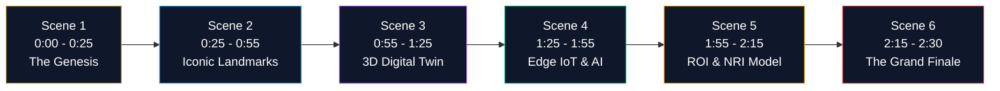

# HRL International × Rohan Corporation — Master Explainer Video Script & Storyboard

**Video Title**: *Bridging Civil Grandeur with Computational Intelligence*  
**Duration**: ~2 Minutes 30 Seconds  
**Resolution**: 4K UHD (3840 × 2160) / 1080p (1920 × 1080) at 60 FPS  
**Target Audience**: Prospective Luxury Homebuyers, Commercial Tenants, Global NRI Investors & Strategic Partners  
**Audio Score**: Cinematic Obsidian & Gold Ambient Electronic Chords, Sub-bass swell, Crisp Spatial Audio  
**Narrator Tone**: Warm, articulate, refined, polite executive female voice (Samantha)  

---

## Storyboard & Scene Breakdown

---

### Scene 1: The Genesis & The Vision (0:00 – 0:25)
* **Visuals**: Deep obsidian cosmos fading into a sunrise over the Arabian Sea and Mangaluru skyline. Gold particle lines converge to form the dual emblems: `HRL™` and `ROHAN CORPORATION`.
* **On-Screen Text**:
  - HRL INTERNATIONAL × ROHAN CORPORATION
  - Mangaluru Smart PropTech Initiative • 2026
* **Voiceover (VO)**:
  > *"For over thirty years, Rohan Corporation has sculpted the skyline of Mangaluru, engineering architectural landmarks celebrated for enduring luxury and trust. Today, that legacy of physical grandeur converges with the apex of computational intelligence. Welcome to the HRL International and Rohan Corporation PropTech Platform."*
* **Sound Design**: Deep orchestral synth swell with crisp glass chime.

---

### Scene 2: The Landmark Portfolio (0:25 – 0:55)
* **Visuals**: Apple Bento cards showcase authentic high-resolution photographic renders of the four premier properties with subtle Ken Burns motion:
  1. **Rohan City (Bejai)**: 3, 2 & 1 BHK Apartments & Commercial Spaces.
  2. **Rohan Marina One (Surathkal)**: 2, 3 & 4 BHK Sea-Facing Apartments.
  3. **Rohan Square (Pumpwell)**: Ready to Move In Homes & Corporate Suites.
  4. **Rohan Estate (Neermarga)**: Hillside Plotted Sanctuary starting from 5.5 Cents.
* **On-Screen Text**:
  - Four Landmark Developments Across Mangaluru
  - 100% Karnataka RERA Sanctioned & Approved
* **Voiceover (VO)**:
  > *"Our joint initiative powers Rohan Corporation's premier developments: Rohan City at Bejai, Rohan Marina One at Surathkal beach, Rohan Square at Pumpwell, and the hillside paradise of Rohan Estate at Neermarga. Each project is fully RERA approved and engineered for generational permanence."*
* **Sound Design**: Gentle, warm analog synthesizer chords.

---

### Scene 3: Rohan City — Bejai Deep Dive (0:55 – 1:25)
* **Visuals**: Full cinematic showcase of the Rohan City architectural render with subtle camera dolly and clean Apple Bento technical specifications.
* **On-Screen Text**:
  - Rohan City • Bejai Main Road, Mangaluru
  - 3.5M+ Sq. Ft. Mixed-Use Ecosystem
  - 3D Interactive Digital Twin • Daylight Simulation • Zero-Cloud IoT
* **Voiceover (VO)**:
  > *"At Rohan City on Bejai Main Road, over 3.5 million square feet of commercial and residential space comes alive inside the browser. Prospective buyers can explore photorealistic digital twins, inspect sunlight on living balconies, and tour retail plazas at sixty frames per second."*
* **Sound Design**: Spatial ambient harmonics.

---

### Scene 4: Rohan Marina One — Surathkal Waterfront (1:25 – 1:55)
* **Visuals**: Expansive cinematic view of the Rohan Marina One beachfront render with coastal horizon vectors and clean NRI reservation telemetry.
* **On-Screen Text**:
  - Rohan Marina One • Surathkal Beachfront, Mangalore
  - Where Every Home Faces the Sea • 2, 3 & 4 BHK Residences
  - 100% Sea-Horizon Visibility • Coastal Breeze Shaders
* **Voiceover (VO)**:
  > *"At Rohan Marina One in Surathkal, where every home faces the sea, our visual computing engine models panoramic ocean horizons, coastal breeze vectors, and unobstructed sunset vistas, enabling seamless remote reservations for NRI families across the globe."*
* **Sound Design**: Ocean-inspired acoustic swell with crystal chimes.

---

### Scene 5: Rohan Square & Rohan Estate (1:55 – 2:15)
* **Visuals**: Side-by-side balanced showcase featuring the ready-to-move-in urban complex at Rohan Square and the lush green plotted sanctuary at Rohan Estate.
* **On-Screen Text**:
  - Rohan Square: Ready to Move In • NH-66 Arterial Gateway
  - Rohan Estate: Neermarga Hills • Plots from 5.5 Cents
  - Edge IoT Telemetry • DPDP Act 2023 Resident Privacy
* **Voiceover (VO)**:
  > *"From corporate suites and ready-to-move-in homes at Rohan Square Pumpwell, to serene hillside plotted enclaves with subsoil telemetry at Rohan Estate Neermarga, intelligent edge sensors provide real-time assurance with zero cloud privacy risks."*
* **Sound Design**: Warm acoustic bass and uplifting harmonic progression.

---

### Scene 6: Executive Partnership & Grand Finale (2:15 – 2:30)
* **Visuals**: Executive signatories card presenting Pavan Kumar Sadashiv (HRL International) and Rohan Monteiro (Rohan Corporation) with clear Phase 1 pilot sanction call-to-action.
* **On-Screen Text**:
  - HRL International Private Limited × Rohan Corporation
  - The Future of Living Begins Today
  - Phase 1 Pilot Sanction: Rohan City Drone & LiDAR Baseline Survey
* **Voiceover (VO)**:
  > *"HRL International and Rohan Corporation. Together, we are establishing the benchmark for luxury living and smart real estate in Coastal Karnataka. The future of living begins today."*
* **Sound Design**: Resonant cinematic finale chord resolving into clean silence.

---

*Authored by HRL International Private Limited for Rohan Corporation.*
