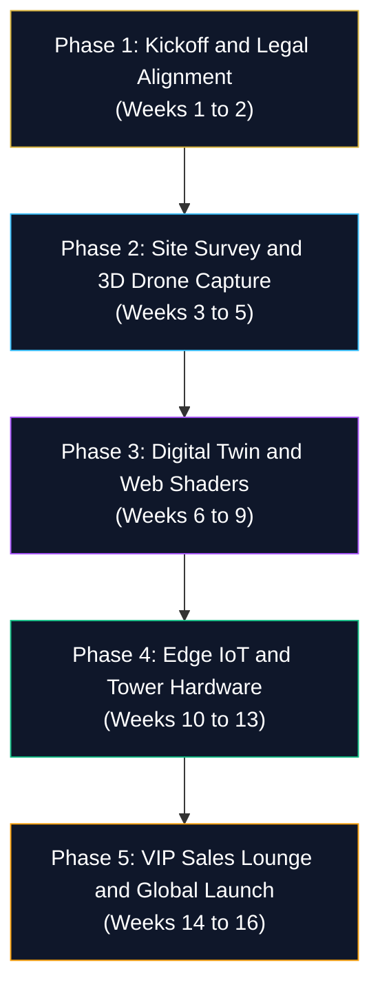

# HRL International × Rohan Corporation — Project Startup & Execution Blueprint

**Initiative**: Smart PropTech & Next-Generation Digital Real Estate Platform  
**Collaborating Principals**:
- **HRL International Private Limited** (Founder & Managing Director: Pavan Kumar Sadashiv)
- **Rohan Corporation** (Founder & Managing Director: Rohan Monteiro)  
**Document Version**: Operational Launch Edition (2026)  
**Execution Cycle**: 16-Week Rapid Deployment Framework  

---

## 1. Master Execution Timeline Overview

The project is structured into **5 sequential phases** spanning 16 weeks, moving from legal alignment to drone capture, digital twin pipeline, edge hardware deployment, and VIP sales lounge launch.



---

## 2. Phase-by-Phase Operational Blueprint

### Phase 1: Formal Kickoff & Legal Alignment (Weeks 1 – 2)
**Objective**: Establish governance, access site blueprints, and finalize joint venture protocols.

1. **Joint Steering Committee Formation**:
   - Technical Principal: Pavan Kumar Sadashiv (HRL International).
   - Infrastructure Principal: Executive Project Lead (Rohan Corporation).
2. **Statutory Handoff & Data Ingestion**:
   - Receive sanctioned architectural CAD/BIM drawings for **Rohan City** (Bejai) and **Rohan Crown** (Kadri).
   - Verify Karnataka RERA sanctioned numbers and boundary coordinates.
3. **Escrow & Grant Account Setup**:
   - Activate the dedicated project operational account in Mangaluru as per GFR 2017 standards.

---

### Phase 2: Aerial Drone Surveying & 3D Spatial Capture (Weeks 3 – 5)
**Objective**: Generate millimeter-accurate 3D point clouds and elevation meshes.

1. **Flight Authorizations & Ground Control**:
   - Establish RTK Ground Control Points (GCPs) on-site using D-RTK 2 base stations.
   - Program automated grid flight trajectories for the DJI Mavic 3 Enterprise survey drone.
2. **Field Capture Operations**:
   - **Rohan City**: Multi-angle facade photogrammetry and arterial road traffic vectors along Bejai Main Road.
   - **Rohan Crown**: High-altitude horizon scanning for Arabian Sea sunset angles and unobstructed balcony views.
   - **Rohan Estate (Neermarga)**: Topographic elevation contours for rolling villa plot topography.
3. **Interior LiDAR Scanning**:
   - Matterport Pro3 / Leica LiDAR scan of standard 2 BHK, 3 BHK, and duplex penthouse layouts.

---

### Phase 3: Visual Computing & Digital Twin Pipeline (Weeks 6 – 9)
**Objective**: Transform raw spatial point clouds into real-time WebGL interactive browser assets.

1. **Mesh Optimization & Gaussian Splatting**:
   - Process raw drone photogrammetry on NVIDIA RTX 4090 / RTX 6000 Ada workstations.
   - Reduce multi-million polygon meshes into lightweight, 60 FPS WebGL assets (<15MB compressed).
2. **Solar Azimuth & Lighting Simulation**:
   - Calibrate natural sunlight angles from 06:00 to 18:30 IST across all four seasons.
   - Incorporate ACEScc color science for realistic coastal glare, sea mist, and sunset tones.
3. **Interactive Portal Integration**:
   - Deploy interactive unit configurators, dynamic floor plans, and the ROI/EMI investment simulator on `src/app.js`.

---

### Phase 4: Edge IoT & Tower Hardware Pilot (Weeks 10 – 13)
**Objective**: Install on-premises controllers for zero-cloud building autonomy.

1. **Rohan City Edge Node Setup**:
   - Install NVIDIA Jetson Orin Nano at the commercial gateway for real-time parking occupancy and pedestrian flow analytics.
2. **Tower Micro-PLC Telemetry**:
   - Connect DIN-rail industrial PLCs to generator switchboards, water pumping stations, and solar micro-grids via Modbus RS485.
3. **Zero-Cloud Privacy & Local NAS Deployment**:
   - Install 1U encrypted RAID-10 NAS storage on-site.
   - Guarantee zero transmission of resident biometric logs to external public clouds under DPDP Act 2023.

---

### Phase 5: VIP Sales Lounge, VR Immersion & Global Launch (Weeks 14 – 16)
**Objective**: Deliver an extraordinary buyer consultation experience and launch global NRI outreach.

1. **Sales Experience Center Setup (Pumpwell Head Office)**:
   - Install 55-inch to 65-inch 4K Multi-Touch Interactive Kiosk running the 3D Masterplan Explorer.
   - Configure Apple Vision Pro and Meta Quest 3 headsets for 1:1 scale virtual penthouse walkthroughs.
2. **Sales Team Training**:
   - Train Rohan Corporation relationship managers on operating the digital twin and ROI simulator during client meetings.
3. **Public Launch & Global NRI Rollout**:
   - Launch production portal on custom domain (`proptech.rohancorporation.in` / `hrlpavan.github.io`).
   - Initiate targeted investor campaigns across the Mangalorean diaspora in the Gulf (UAE, Qatar, Saudi Arabia, Kuwait) and Western hubs.

---

## 3. Immediate Action Items (First 7 Days Checklist)

```
[ ] Day 1: Conclude formal kickoff meeting with Rohan Monteiro and executive team at Pumpwell office.
[ ] Day 2: Sign mutual NDA and execute the HRL x Rohan Corporation Strategic Partnership Charter.
[ ] Day 3: Receive CAD / DWG blueprints and RERA sanctioned layout drawings for Rohan City.
[ ] Day 4: Order / mobilize field survey gear (DJI RTK drone, GCP markers, high-precision GNSS receiver).
[ ] Day 5: Setup local high-performance processing directory on NVIDIA workstation.
[ ] Day 6: Conduct physical site walk-through at Rohan City (Bejai) to identify RTK launch points.
[ ] Day 7: Execute first calibration test flight and capture initial baseline photogrammetry series.
```

---

## 4. Key Performance Indicators (KPIs) & Success Metrics

| Milestone | Target Target Timeline | Metric of Success |
| :--- | :--- | :--- |
| **Baseline 3D Model** | End of Week 5 | Millimeter-accurate exterior mesh of Rohan City completed. |
| **Web Portal 60 FPS** | End of Week 9 | WebGL Digital Twin renders at 60 FPS on mobile and desktop devices. |
| **Edge Hardware Uptime** | End of Week 13 | 99.9% local telemetry availability with zero external cloud leaks. |
| **Investor Conversion** | Week 16 onward | 35% reduction in sales consultation cycle time for NRI buyers. |

---

*Formulated by HRL International Private Limited for Rohan Corporation.*  
*Official Contact*: `hrlinternationalprivatelimited@gmail.com`
