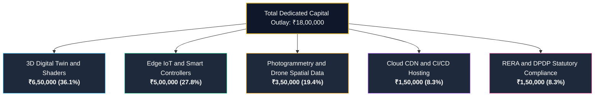

# HRL International × Rohan Corporation — Project Total Expense & Financial Master Plan

**Initiative**: Smart PropTech & Next-Generation Digital Real Estate Ecosystem  
**Collaborating Principals**:
- **HRL International Private Limited** (Managing Director: Pavan Kumar Sadashiv)
- **Rohan Corporation** (Mangaluru, Karnataka)  
**Document Version**: 2026 Edition  
**Statutory Financial Framework**: General Financial Rules (GFR 2017) & Karnataka RERA Standards  

---

## 1. Executive Summary

This master expense schedule provides an exhaustive financial framework covering:
1. **The HRL International Core R&D & Statutory Grant Tracks** (₹20 Lakhs PoC vs. ₹50 Lakhs Commercial Scale).
2. **The HRL × Rohan Corporation PropTech Platform Development Outlay** (₹18 Lakhs total capital requirement).
3. **The Real Estate Unit Investment & Buyer Expense Matrix** (tailored for landmark developments such as Rohan City and Rohan Crown).

---

## 2. Core R&D & Statutory Grant Expense Matrix

| Major Expense Head | Allocation (%) | ₹20 Lakhs Track (PoC / Seed) | ₹50 Lakhs Track (Commercial Scale) | Key Deliverables & Scope |
| :--- | :---: | :---: | :---: | :--- |
| **1. Core R&D & Software Engineering** | **40.0%** | **₹8,00,000** | **₹20,00,000** | C++/CUDA graphics engine, neural pipeline orchestration, developer SDK tooling |
| **2. GPU Infrastructure & High-Performance Compute** | **30.0%** | **₹6,00,000** | **₹15,00,000** | High-throughput NVIDIA L4/A100 instances, low-latency CDN, distributed databases |
| **3. Intellectual Property, Patents & Trademarks** | **10.0%** | **₹2,00,000** | **₹5,00,000** | Indian Patent Office (IPO) filings, TM-A marks, WIPO Madrid international protection |
| **4. Beta Pilots & Market Validation** | **20.0%** | **₹4,00,000** | **₹10,00,000** | 100–500 studio/client pilot testing, benchmark datasets, technical documentation |
| **TOTAL CAPITAL OUTLAY** | **100.0%** | **₹20,00,000** | **₹50,00,000** | *Disbursed across 4 milestone-linked quarterly tranches* |

---

## 3. PropTech Platform Dedicated Capital Outlay

For the direct implementation of the **HRL × Rohan Corporation** technology stack across Rohan City, Rohan Crown, Rohan Square, and Rohan Estate:



| Component | Budgeted Expense | Purpose & Technical Scope |
| :--- | :---: | :--- |
| **Interactive 3D Digital Twin Engine & Shaders** | **₹6,50,000** | WebGL / Canvas sunlight simulation, floor plan configurator, virtual tour engine |
| **Photogrammetry & Drone Elevation Data** | **₹3,50,000** | High-precision spatial mapping of Rohan City, Rohan Crown, and Rohan Estate |
| **Edge IoT Smart-Home Gateways & Controllers** | **₹5,00,000** | On-premise zero-cloud micro-controllers for building HVAC, biometric access & energy |
| **Global CDN, Hosting & DevOps Pipeline** | **₹1,50,000** | GitHub Pages / Vercel Edge infrastructure, SSL certificates, automated CI/CD |
| **RERA Governance & DPDP 2023 Compliance Audits** | **₹1,50,000** | Statutory verification, RERA documentation sync, legal data privacy verification |
| **TOTAL ESTIMATED PLATFORM EXPENSE** | **₹18,00,000** | **Comprehensive Full-Stack Rollout & Infrastructure** |

---

## 4. Quarterly Milestone & Disbursement Schedule

The capital allocation is phased across four strategic tranches:

```
[ Tranche 1: 30% ] > Core System Setup, 3D Elevation Modeling, Trademark & Legal Structuring
[ Tranche 2: 30% ] > WebGL Digital Twin Engine, Azure/GCP Cloud Architecture & Drone Topography
[ Tranche 3: 25% ] > Edge IoT Controller Deployment & Resident Portal Onboarding
[ Tranche 4: 15% ] > Full Public Launch, RERA Statutory Audit & Performance Review
```

---

## 5. Landmark Property Investment Expense Model

Based on the interactive portal's financial intelligence simulator for a benchmark luxury residence (e.g., at Rohan City, Bejai):

* **Benchmark Unit Value**: **₹85,00,000** (₹85 Lakhs)
* **Down Payment (20%)**: **₹17,00,000** (₹17 Lakhs)
* **Loan Principal**: **₹68,00,000** (₹68 Lakhs)
* **Monthly Outlay (8.5% Interest @ 20-Year Tenure)**: **₹59,045 / month**
* **Total 20-Year Interest Expense**: **₹73,70,800** (₹73.71 Lakhs)
* **Projected Annual Gross Rental Yield**: **₹4,25,000 / year** (~5.0% yield)
* **5-Year Projected Property Valuation**: **₹1,24,89,000** (₹1.25 Crores @ 8% CAGR)

---

## 6. Financial Governance & Zero Diversion Covenant

1. **Dedicated Account**: All collaborative funds are held in a scheduled commercial bank in Mangaluru, Karnataka.
2. **Statutory Audit**: Expenditures are subject to periodic Chartered Accountant certification and utilization reports.
3. **Zero Diversion Clause**: Strict adherence ensures funds are never diverted to non-project or speculative activities.

---

*Formulated by HRL International Private Limited in collaboration with Rohan Corporation.*  
*Contact*: `hrlinternationalprivatelimited@gmail.com`
