# HRL International × Rohan Corporation — Project Total Expense & Financial Master Budget
**Document Version:** 2026 Enterprise Capital Edition (v3.4)  
**Collaborating Principals:**
- **HRL International Private Limited** (Managing Director: Pavan Kumar Sadashiv)
- **Rohan Corporation** (Founder & Chairman: Rohan Monteiro, Mangaluru, Karnataka)  
**Statutory Financial Framework:** General Financial Rules (GFR 2017), Karnataka RERA, and FEMA Guidelines  
**Audited Platform URL:** `http://localhost:3000`  
**Repository:** `https://github.com/hrlpavan/hrl-x-rohan-corporation`

---

## 1. Executive Summary

This master financial budget provides an exhaustive, multi-tier financial framework governing the collaborative development, deployment, and commercial scaling of the **HRL International™ × Rohan Corporation PropTech Platform & 19-Pillar Venture Architecture**.

The budget encapsulates:
1. **Core R&D & Statutory Grant Tracks** (₹20 Lakhs PoC vs. ₹50 Lakhs Commercial Scale).
2. **PropTech Platform Phased Capital Outlay**:
   - **Phase 1 (MVP / Foundational Rollout)**: ₹18,00,000
   - **Phase 2 (v3.0–v3.4 Enterprise Venture Architecture Expansion)**: ₹38,50,000
   - **Total Consolidated Platform Capital Budget**: **₹56,50,000**
3. **Enterprise Return on Investment (ROI) & Profit & Loss (P&L) Impact**: Quantifying the transition from a 22.5% legacy developer margin to a **38.1% EBITDA margin** under HRL Venture Architecture.
4. **Investor Unit Investment & Yield Model**: Asset-level cash flows across Rohan City, Rohan Marina One, Rohan Square, and Rohan Estate.
5. **Statutory Governance, Zero-Diversion Covenant & Escrow Architecture**.

---

## 2. Core R&D & Statutory Grant Expense Matrix

Structured under the statutory frameworks of Karnataka Startup Policy, DST/MeitY Innovation Grants, and Central GFR 2017 guidelines:

| Major Expense Head | Allocation (%) | ₹20 Lakhs Track (PoC / Seed) | ₹50 Lakhs Track (Commercial Scale) | Key Deliverables & Technical Scope |
| :--- | :---: | :---: | :---: | :--- |
| **1. Core R&D & Software Engineering** | **40.0%** | **₹8,00,000** | **₹20,00,000** | Spatial visual computing, neural pricing algorithms, 1,800ms Brown tick engine, Web Audio synthesis |
| **2. GPU Infrastructure & High-Performance Compute** | **30.0%** | **₹6,00,000** | **₹15,00,000** | High-throughput NVIDIA L4/A100 instances, low-latency CDN, distributed telemetry databases |
| **3. Intellectual Property, Patents & Trademarks** | **10.0%** | **₹2,00,000** | **₹5,00,000** | Indian Patent Office (IPO) filings, TM-A marks, WIPO Madrid international protection for HRL Core™ |
| **4. Beta Pilots & Real-World Site Telemetry** | **20.0%** | **₹4,00,000** | **₹10,00,000** | On-site drone LiDAR calibration, edge BMS hardware validation, sensor stress testing |
| **TOTAL STATUTORY GRANT CAPITAL** | **100.0%** | **₹20,00,000** | **₹50,00,000** | *Disbursed across 4 milestone-linked quarterly tranches* |

---

## 3. Dedicated Platform Capital Outlay (Phase 1 vs. Phase 2)

```mermaid
flowchart TD
    Consolidated["Total Consolidated Platform Budget: ₹56,50,000"]
    
    Consolidated --> P1["Phase 1: Foundational MVP (₹18,00,000)<br/><i>31.9% of Total Budget</i>"]
    Consolidated --> P2["Phase 2: v3.0-v3.4 Enterprise Expansion (₹38,50,000)<br/><i>68.1% of Total Budget</i>"]

    P1 --> A1["3D Digital Twin & Shaders: ₹6,50,000"]
    P1 --> A2["Edge IoT Gateways: ₹5,00,000"]
    P1 --> A3["Photogrammetry & Drone Data: ₹3,50,000"]
    P1 --> A4["Global CDN & Hosting: ₹1,50,000"]
    P1 --> A5["RERA & DPDP Compliance: ₹1,50,000"]

    P2 --> B1["Universal Stock Market & Capital Terminal: ₹5,50,000"]
    P2 --> B2["3D Axonometric & Solar Azimuth Engine: ₹6,00,000"]
    P2 --> B3["Studio Human Voice Narration Engine: ₹4,50,000"]
    P2 --> B4["19-Pillar Venture Architecture & Matrix: ₹6,50,000"]
    P2 --> B5["Edge BMS Ultrasonic & Microgrid Enclaves: ₹8,00,000"]
    P2 --> B6["Standalone Microsites & Yield Engines: ₹4,50,000"]
    P2 --> B7["Executive P&L & Waterfall Simulators: ₹3,50,000"]

    style Consolidated fill:#0f172a,stroke:#dfb76c,stroke-width:2px,color:#ffffff
    style P1 fill:#1e293b,stroke:#38bdf8,stroke-width:1px,color:#ffffff
    style P2 fill:#1e293b,stroke:#10b981,stroke-width:1px,color:#ffffff
```

### Phase 1: Foundational PropTech Rollout (Completed)
| Component | Budget (INR) | Purpose & Technical Deliverables | Status |
| :--- | :---: | :--- | :---: |
| **Interactive 3D Digital Twin Engine & Shaders** | **₹6,50,000** | Initial WebGL / Canvas sunlight simulation, floor plan configurator | **Delivered** |
| **Photogrammetry & Drone Elevation Data** | **₹3,50,000** | High-precision spatial mapping of Rohan City, Rohan Marina One, and Rohan Estate | **Delivered** |
| **Edge IoT Smart-Home Gateways & Controllers** | **₹5,00,000** | On-premise micro-controllers for building HVAC, biometric access & energy | **Delivered** |
| **Global CDN, Hosting & DevOps Pipeline** | **₹1,50,000** | GitHub Pages / Edge infrastructure, SSL certificates, automated CI/CD | **Delivered** |
| **RERA Governance & DPDP 2023 Compliance Audits** | **₹1,50,000** | Statutory verification, RERA documentation sync, legal data privacy verification | **Delivered** |
| **SUBTOTAL PHASE 1** | **₹18,00,000** | *Foundational MVP Stack across 4 flagship developments* | **100% Complete** |

---

### Phase 2: Enterprise Venture Architecture Expansion (v3.0 – v3.4)
| Component | Budget (INR) | Scope & Technical Deliverables | Status |
| :--- | :---: | :--- | :---: |
| **Universal Stock Market & Global Capital Terminal** | **₹5,50,000** | Built-in `#stockmarket` terminal, live `#globalMarketTicker` marquee tape, Brownian procedural tick engine, global session clocks (NYC, London, Dubai, Mumbai, Tokyo) | **Delivered (v3.4)** |
| **3D Axonometric Visual Computing Engine** | **₹6,00,000** | Custom 2D/3D Canvas engine, solar vector azimuth for Mangaluru ($12.87^\circ\text{N}, 74.88^\circ\text{E}$), thermal heat-gain simulation, Apple Keynote segmented controls | **Delivered (v3.0)** |
| **Studio-Grade Human Voice Narration Engine** | **₹4,50,000** | Tri-voice persona switcher (Daniel, Samantha, Rishi), acoustic audio ducking (`0.20 \to 0.06`), zero-cache server audio streaming pool | **Delivered (v3.0)** |
| **19-Pillar Venture Architecture Codification & Matrix** | **₹6,50,000** | Comprehensive 4-quadrant venture matrix, modal deep dives, quantitative KPI telemetry, and developer blindspot resolutions | **Delivered (v3.0)** |
| **Edge BMS, Ultrasonic Telemetry & Microgrid Enclaves** | **₹8,00,000** | Ultrasonic acoustic leak telemetry, LiFePO4 battery peak-shaving BMS, on-premise DPDP 2023 hardware enclave (Pillars 13–16) | **In Deployment** |
| **Standalone Widescreen Cinema 2.37:1 Microsites** | **₹4,50,000** | Dedicated standalone portals for Rohan City, Rohan Marina One, Rohan Square, and Rohan Estate with anamorphic video integration | **Delivered (v3.0)** |
| **Executive P&L & Venture Waterfall Simulators** | **₹3,50,000** | Real-time `#pnl-profile` comparison table, capital waterfall GDV simulator, and 60-month amortization wealth creation canvas | **Delivered (v3.2)** |
| **SUBTOTAL PHASE 2** | **₹38,50,000** | *Enterprise Capital Edition Platform Engineering* | **Active / Live** |
| **TOTAL CONSOLIDATED PLATFORM CAPITAL** | **₹56,50,000** | **Complete Full-Stack Enterprise Platform Budget** | **Operational** |

---

## 4. Enterprise Profit & Loss (P&L) Impact for Rohan Corporation

The deployment of the **HRL Venture Architecture** fundamentally re-engineers project economics compared to legacy developer practices:

### Comparative P&L Statement (₹100 Cr Benchmark GDV)

| P&L Line Item | Legacy Developer Model | HRL Venture Architecture Model | Operational Driver / Source of Alpha |
| :--- | :---: | :---: | :--- |
| **Gross Development Value (GDV)** | ₹100.00 Cr | **₹114.20 Cr** | **+14.2% GDV** via Neural Yield Inventory Pricing (Pillar 02) |
| **Direct Construction & Prefab Cost** | (₹46.00 Cr) | **(₹41.80 Cr)** | **-9.1% Cost** via JIT Supply Chain & 4D Drone LiDAR (Pillars 09–11) |
| **Financing & Interest Carry Cost** | (₹12.00 Cr) | **(₹7.50 Cr)** | **-37.5% Interest** via 72h Bank Consortia & NRI Escrow (Pillars 01, 04) |
| **Sales, Marketing & Broker Brokerage** | (₹6.00 Cr) | **(₹3.20 Cr)** | **-46.7% CAC** via Autonomous Voice AI & WhatsApp CRM (Pillars 05, 08) |
| **Statutory, Legal & Compliance** | (₹3.50 Cr) | **(₹2.10 Cr)** | Automated SHA-256 Title & RERA Vault clearing (Pillar 19) |
| **Platform Operating & Tech Royalty** | (₹0.00 Cr) | **(₹2.50 Cr)** | Platform infrastructure, Edge BMS nodes & tick engines |
| **Secondary Syndication & Fee Income** | ₹0.00 Cr | **₹4.80 Cr** | Fractional syndication & secondary exchange trading fees (Pillars 03, 18) |
| **GROSS OPERATING EBITDA** | **₹22.50 Cr (22.5%)** | **₹43.51 Cr (38.1%)** | **+15.6% EBITDA Margin Expansion (+₹21.01 Cr Net)** |

---

## 5. Landmark Property Investment Expense Model

Granular unit economics for individual high-net-worth investors across key developments:

| Development | Typology | Benchmark Price | Down Payment (20%) | Monthly EMI (8.5% / 20Y) | Net Annual Yield | 5-Year Projected Valuation |
| :--- | :--- | :---: | :---: | :---: | :---: | :---: |
| **Rohan City** (Bejai) | 2 BHK Executive Residence | **₹85,00,000** | ₹17,00,000 | ₹59,045 | **5.4%** | ₹1,24,89,000 |
| **Rohan City** (Bejai) | 3 BHK Sky Residence | **₹1,35,00,000** | ₹27,00,000 | ₹93,837 | **5.8%** | ₹1,98,42,000 |
| **Rohan Marina One** | Waterfront Penthouse | **₹2,65,00,000** | ₹53,00,000 | ₹1,84,168 | **6.4%** | ₹4,02,80,000 |
| **Rohan Square** | Grade-A Retail Frontage | **₹1,90,00,000** | ₹38,00,000 | ₹1,32,042 | **7.8%** | ₹2,88,80,000 |
| **Rohan Estate** | 4-BHK Luxury Villa Enclave | **₹2,20,00,000** | ₹44,00,000 | ₹1,52,893 | **6.1%** | ₹3,41,00,000 |

---

## 6. Financial Governance & Zero Diversion Covenant

1. **Dedicated Project Escrow Accounts**:
   - All collaborative capital, investor disbursements, and platform revenues are deposited into designated, non-fungible scheduled commercial bank escrow accounts in Mangaluru.
2. **Milestone-Linked Disbursal Gate**:
   - Fund releases occur strictly upon digital verification of engineering milestone completion (validated by 4D Drone LiDAR and verified bills of quantities).
3. **Statutory Audit & Certification**:
   - Quarterly reviews and balance sheet reconciliation executed by independent, ICAI-licensed Chartered Accountants.
4. **Absolute Zero-Diversion Guarantee**:
   - Contractually bound under Karnataka RERA Section 4(2)(l)(D): 70% of all real estate receivables remain ring-fenced for development and debt clearance, while tech platform royalties are strictly capped at performance-linked thresholds.

---

*Formulated and Approved by HRL International Private Limited in collaboration with Rohan Corporation.*  
*Official Repository*: [https://github.com/hrlpavan/hrl-x-rohan-corporation](https://github.com/hrlpavan/hrl-x-rohan-corporation)  
*Corporate Inquiries*: `hrlinternationalprivatelimited@gmail.com`
